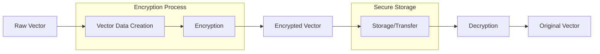
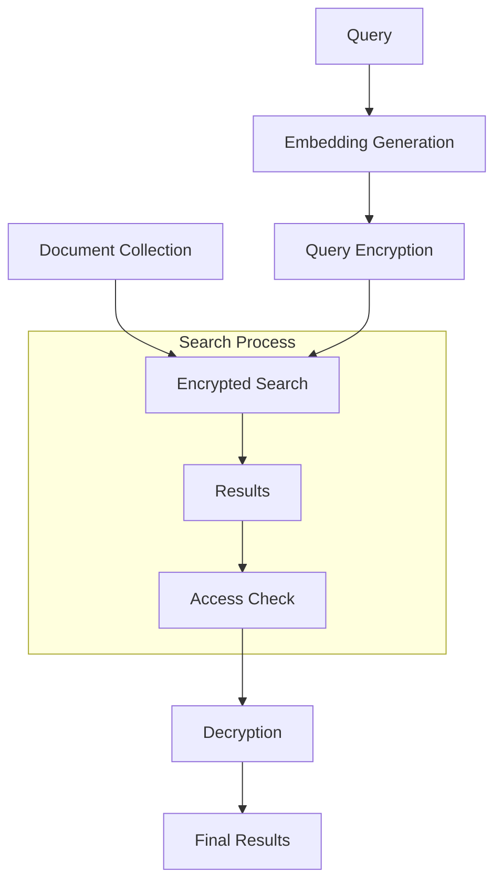
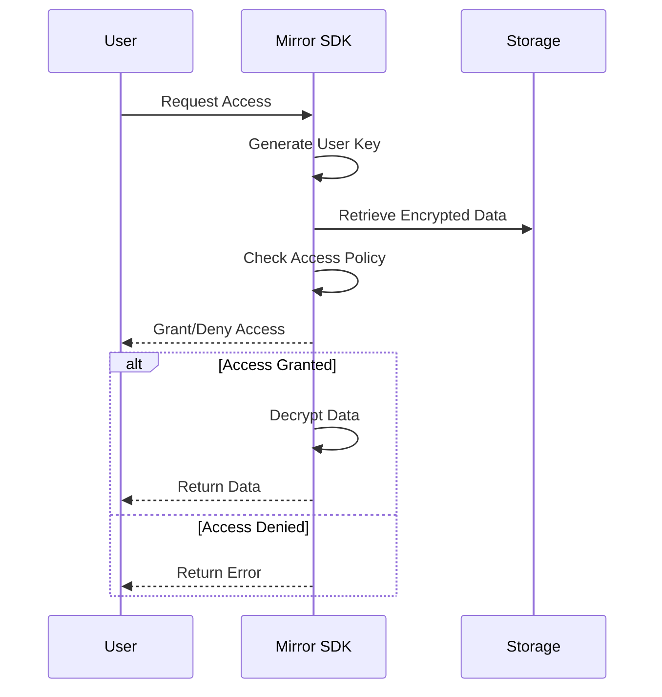
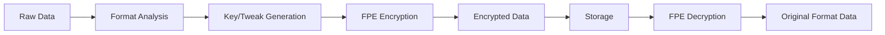

## Introduction

This document details the core data flows in the Mirror SDK, including secure vector operations, access control, format preservation, and their interactions. Each flow demonstrates how data moves through the system while maintaining security and privacy.

## Vector Operation Flows

### Basic Vector Encryption Flow



Implementation Example:
```python
from mirror_sdk.core.models import VectorData

class VectorFlow:
    def __init__(self, sdk):
        self.sdk = sdk

    def process_vector(self, raw_vector, metadata=None):
        # 1. Create Vector Data
        vector_data = VectorData(
            vector=raw_vector,
            id=str(uuid4()),
            metadata=metadata
        )

        # 2. Encryption
        encrypted = self.sdk.vector.encrypt(vector_data)

        # 3. Store/Transfer
        store_result = self.store_encrypted_vector(encrypted)

        return store_result

    def retrieve_vector(self, vector_id):
        # 1. Retrieve encrypted vector
        encrypted = self.get_stored_vector(vector_id)

        # 2. Decrypt
        decrypted = self.sdk.vector.decrypt(encrypted)

        return decrypted.vector
```

### Secure Vector Search Flow



Implementation Example:
```python
class SecureSearchFlow:
    def __init__(self, sdk, chroma_client):
        self.sdk = sdk
        self.collection = chroma_client.create_collection(
            name="secure_vectors",
            metadata={"hnsw:space": "cosine"}
        )

    async def index_documents(self, documents):
        encrypted_docs = []
        for doc in documents:
            # Generate embedding
            embedding = self.get_embedding(doc.content)
            
            # Encrypt embedding
            vector_data = VectorData(
                vector=embedding,
                id=doc.id
            )
            encrypted = self.sdk.vector.encrypt(vector_data)
            encrypted_docs.append(encrypted)

        # Store in vector database
        self.collection.add(
            ids=[doc.id for doc in documents],
            embeddings=[ed.ciphertext for ed in encrypted_docs],
            documents=[doc.content for doc in documents],
            metadatas=[{
                "iv": ed.iv,
                "auth_hash": ed.auth_hash
            } for ed in encrypted_docs]
        )

    async def search(self, query, n_results=5):
        # Generate query embedding
        query_embedding = self.get_embedding(query)
        
        # Encrypt query
        query_data = VectorData(
            vector=query_embedding,
            id="query"
        )
        encrypted_query = self.sdk.vector.encrypt(query_data)

        # Perform search
        results = self.collection.query(
            query_embeddings=[encrypted_query.ciphertext],
            n_results=n_results
        )

        return self.process_results(results)
```

## RBAC Access Control Flow



Implementation Example:
```python
class RBACFlow:
    def __init__(self, sdk):
        self.sdk = sdk

    def setup_access_policy(self):
        # Define organization structure
        app_policy = {
            "roles": ["admin", "analyst", "user"],
            "groups": ["research", "trading"],
            "departments": ["equities", "fixed_income"]
        }
        self.sdk.set_policy(app_policy)

    def protect_sensitive_data(self, data, policy):
        # Create protected vector
        vector_data = RBACVectorData(
            vector=data,
            id=str(uuid4()),
            access_policy=policy
        )

        # Encrypt with access control
        encrypted = self.sdk.rbac.encrypt(vector_data)
        return encrypted

    def access_data(self, encrypted_data, user_key):
        try:
            # Attempt to decrypt with user key
            decrypted = self.sdk.rbac.decrypt(
                encrypted_data.crypto,
                encrypted_data.encrypted_header,
                user_key
            )
            return {"success": True, "data": decrypted}
        except MirrorError as e:
            return {"success": False, "error": str(e)}
```

## Format-Preserving Encryption Flow



Implementation Example:
```python
class FPEFlow:
    def __init__(self, sdk):
        self.sdk = sdk

    def process_structured_data(self, data):
        # Generate encryption parameters
        key = self.sdk.metadata.generate_key()
        tweak = self.sdk.metadata.generate_tweak_from_data(data)

        # Encrypt while preserving format
        encrypted = self.sdk.metadata.encrypt(
            data,
            key,
            tweak
        )

        return {
            'encrypted_data': encrypted,
            'key': key,
            'tweak': tweak
        }

    def retrieve_structured_data(self, encrypted_data, key, tweak):
        # Decrypt while maintaining format
        decrypted = self.sdk.metadata.decrypt(
            encrypted_data,
            key,
            tweak
        )
        return decrypted
```

## Combined Workflow Examples

### Secure Document Processing Flow

```python
class SecureDocumentFlow:
    def __init__(self, sdk):
        self.sdk = sdk
        self.vector_flow = VectorFlow(sdk)
        self.rbac_flow = RBACFlow(sdk)
        self.fpe_flow = FPEFlow(sdk)

    async def process_document(self, document, policy):
        # 1. Process document content (Vector)
        vector_result = self.vector_flow.process_vector(
            document.embedding
        )

        # 2. Process metadata (FPE)
        metadata_result = self.fpe_flow.process_structured_data(
            document.metadata
        )

        # 3. Apply access control (RBAC)
        protected_doc = self.rbac_flow.protect_sensitive_data(
            {
                'vector': vector_result,
                'metadata': metadata_result
            },
            policy
        )

        return protected_doc

    async def retrieve_document(self, doc_id, user_key):
        # 1. Access check
        access_result = self.rbac_flow.access_data(
            self.get_stored_document(doc_id),
            user_key
        )

        if not access_result['success']:
            return None

        # 2. Decrypt document components
        vector = self.vector_flow.retrieve_vector(
            access_result['data']['vector']
        )

        metadata = self.fpe_flow.retrieve_structured_data(
            access_result['data']['metadata']
        )

        return {
            'vector': vector,
            'metadata': metadata
        }
```

## Error Handling

Each flow should implement proper error handling:

```python
class SecureFlowError(Exception):
    pass

class FlowErrorHandler:
    @staticmethod
    def handle_error(operation):
        try:
            return operation()
        except MirrorError as e:
            if isinstance(e, AccessDeniedError):
                raise SecureFlowError("Access denied")
            elif isinstance(e, EncryptionError):
                raise SecureFlowError("Encryption failed")
            else:
                raise SecureFlowError(f"Operation failed: {str(e)}")
```

## Flow Monitoring

```python
class FlowMonitor:
    def __init__(self):
        self.metrics = defaultdict(list)

    def track_flow(self, flow_name, duration):
        self.metrics[flow_name].append({
            'duration': duration,
            'timestamp': datetime.utcnow()
        })

    def get_flow_metrics(self, flow_name):
        flow_data = self.metrics[flow_name]
        return {
            'avg_duration': sum(d['duration'] for d in flow_data) / len(flow_data),
            'total_operations': len(flow_data),
            'last_operation': flow_data[-1] if flow_data else None
        }
```

## Best Practices

1. **Flow Implementation**
   - Always implement proper error handling
   - Monitor flow performance
   - Maintain audit trails
   - Follow security protocols

2. **Data Protection**
   - Encrypt data at earliest possible point
   - Verify access before decryption
   - Implement proper key management
   - Always validate input/output

3. **Performance**
   - Batch operations when possible
   - Implement caching strategies
   - Monitor resource usage
   - Optimize critical paths

4. **Integration**
   - Follow provided patterns
   - Maintain consistent error handling
   - Implement proper logging
   - Use provided SDK utilities

