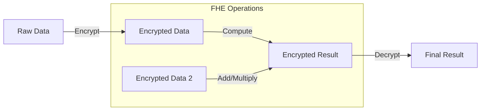
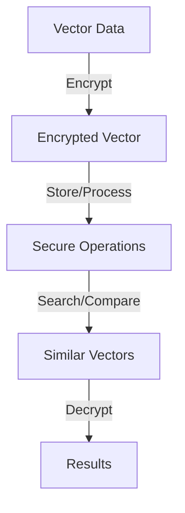
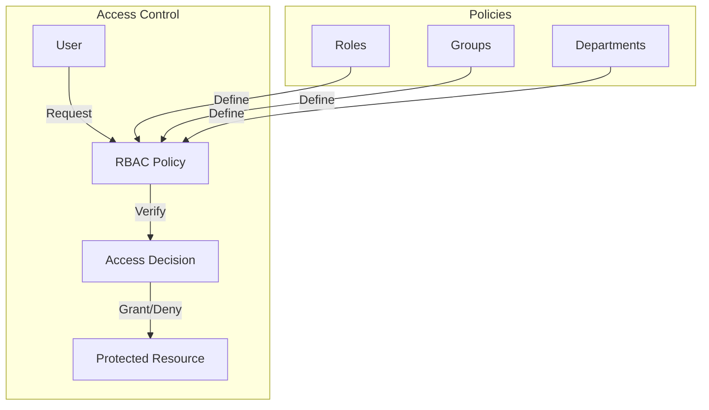
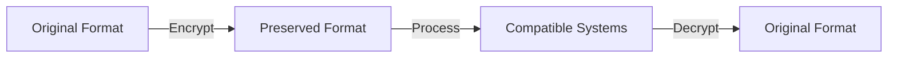
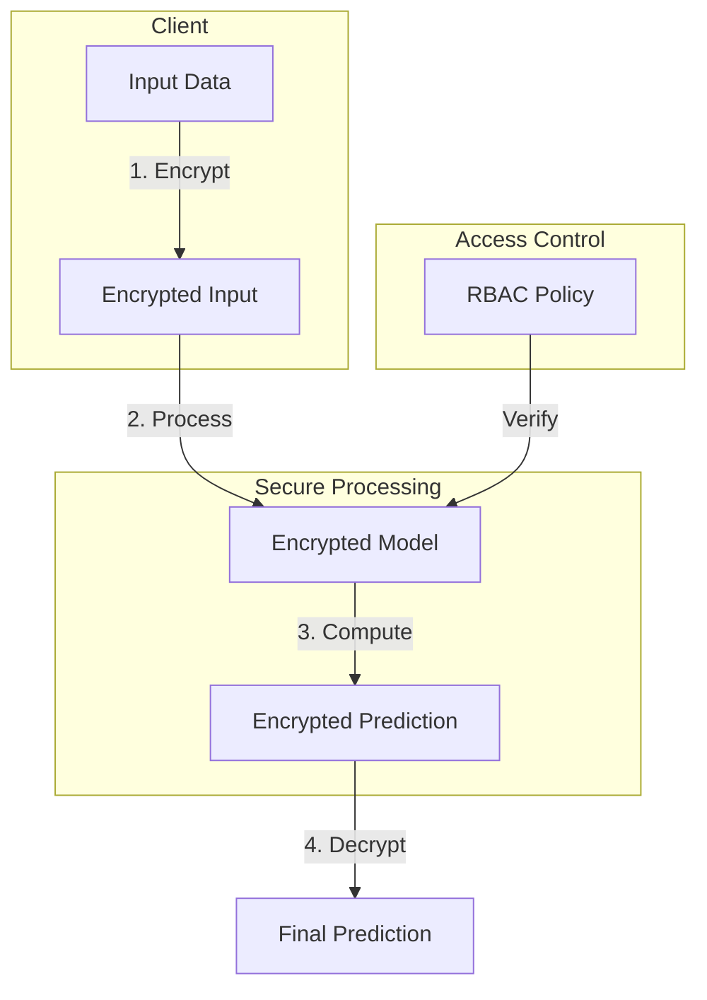
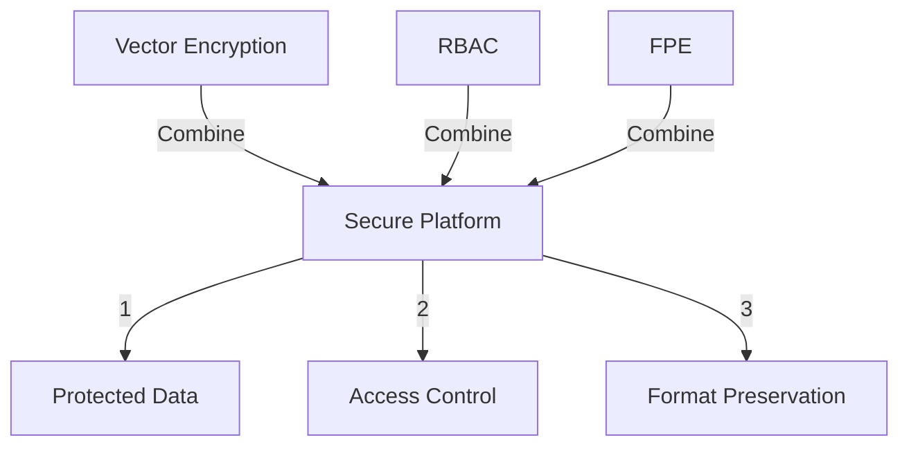

## Table of Contents
- [Fully Homomorphic Encryption (FHE)](#fully-homomorphic-encryption-fhe)
- [Vector Encryption](#vector-encryption)
- [RBAC (Role-Based Access Control)](#rbac-role-based-access-control)
- [Format Preserving Encryption (FPE)](#format-preserving-encryption-fpe)
- [Encrypted Inference](#encrypted-inference)
- [Combined Features](#combined-features)

# Fully Homomorphic Encryption (FHE)

## Overview

Fully Homomorphic Encryption (FHE) enables computation on encrypted data without requiring decryption, providing end-to-end security for sensitive data processing.

## Use Cases

### 1. Privacy-Preserving Analytics
- Process sensitive data while encrypted
- Aggregate results securely
- Maintain data privacy

### 2. Secure Financial Computations
- Protected transaction processing
- Encrypted balance calculations
- Secure audit trails

### 3. Healthcare Analysis
- Process patient data securely
- Protected health metrics
- Compliant data analysis

# Vector Encryption

## Overview

Vector encryption enables secure storage and processing of vector embeddings while preserving their similarity properties.

## Use Cases

### 1. Secure ML Model Feature Storage
- Store model embeddings securely
- Protect proprietary model features
- Enable secure model inference

### 2. Privacy-Preserving Analytics
- Analyze customer behavior patterns
- Secure storage of user preferences
- Protected A/B test results

# RBAC (Role-Based Access Control)

## Overview

RBAC provides fine-grained access control over encrypted data based on organizational roles and structure.

## Use Cases

### 1. Enterprise Document Management
- Different access levels for departments
- Team-based document access
- Project-specific content restrictions

### 2. Healthcare Data Access
- Doctor/Patient data segregation
- Department-specific record access
- Regulatory compliance enforcement

# Format Preserving Encryption (FPE)

## Overview

FPE enables encryption while maintaining the original data format, crucial for systems with strict format requirements.

## Use Cases

### 1. Customer Data Protection
- Credit card number encryption
- Social security number protection
- Phone number anonymization

### 2. Healthcare Records
- Patient ID encryption
- Medical record number protection
- Insurance ID encryption

# Encrypted Inference

## Overview

Encrypted inference combines FHE, vector encryption, and RBAC to enable secure ML model deployment and prediction.

## Use Cases

### 1. Secure Model Deployment
- Protected model weights
- Secure inference pipeline
- Access-controlled predictions

### 2. Privacy-Preserving Predictions
- Secure input processing
- Protected feature extraction
- Confidential results

# Combined Features

## Overview

Mirror SDK enables powerful combinations of its security features for comprehensive solutions.

## Use Cases

### 1. Secure Enterprise Search Platform
Combine RBAC, FPE, and Vector Search for:
- Department-specific document access
- Encrypted metadata handling
- Secure similarity search
- Audit trail maintenance

### 2. Healthcare Information System
Combine all features for:
- Patient record protection
- Doctor-specific access
- Secure case similarity search
- Protected medical prompts

Generated by 🤖 | Checked by 👨‍💻

