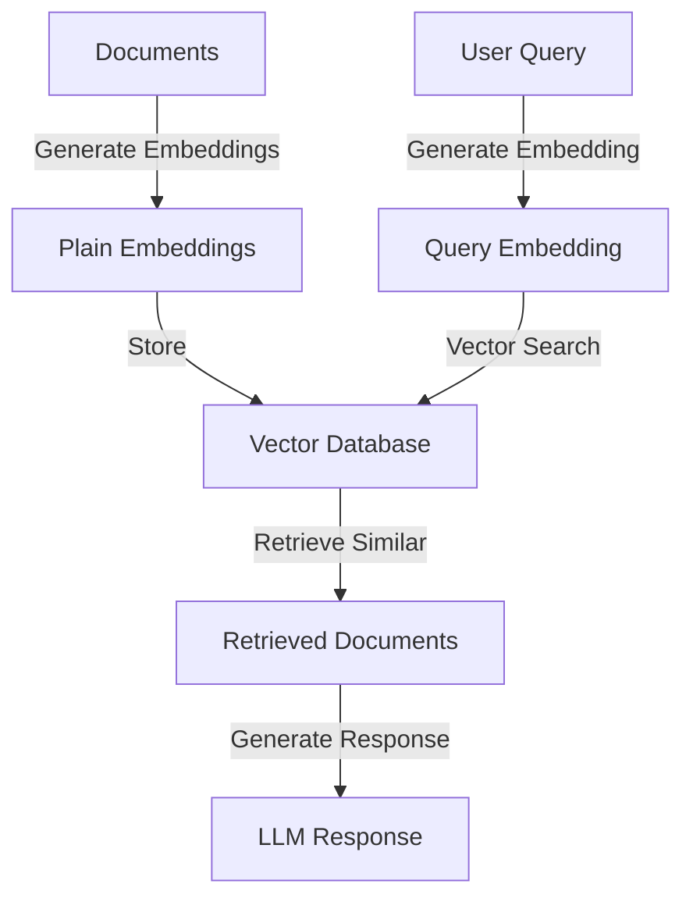
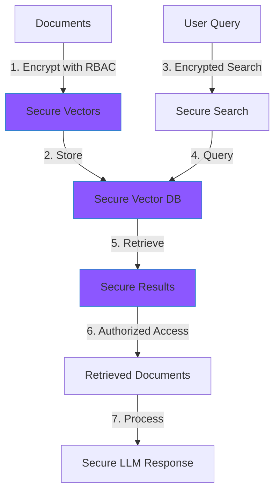

# Secure RAG Implementation Guide

<Tip>
Secure RAG allows organizations to implement Retrieval-Augmented Generation while maintaining data privacy and security throughout the entire pipeline.
</Tip>

## Traditional RAG Implementation

### Before Mirror Vectax
- Embeddings stored in plaintext
- No access control over document retrieval
- Sensitive information exposed during processing
- Limited audit trails
- Compliance risks with data protection regulations

## Secure RAG with Mirror Vectax

### Enhanced Security Features
- Encrypted embeddings
- Role-based access control
- Format-preserving encryption for metadata
- Secure similarity search
- Audit logging
- Compliance-ready architecture

## Implementation Steps

<Steps>
  <Step title="Setup Security Policies">
  Define organizational structure and access controls:
  - Document classification levels
  - User roles and permissions
  - Department access boundaries
  - Audit requirements
  </Step>

  <Step title="Secure Document Processing">
  Implement secure document pipeline:
  - Encrypt document embeddings
  - Protect metadata
  - Configure access policies
  - Set up audit logging
  </Step>

  <Step title="Configure Secure Retrieval">
  Establish secure search infrastructure:
  - Encrypted similarity search
  - Role-based document access
  - Protected result handling
  </Step>

  <Step title="Deploy Protected LLM Interface">
  Set up secure LLM integration:
  - Protected prompt construction
  - Secure context injection
  - Compliance-aware response generation
  </Step>
</Steps>

## Security Benefits

<Accordion title="Enhanced Protection">
1. Data Privacy
   - End-to-end encryption of embeddings
   - Protected document metadata
   - Secure similarity search

2. Access Control
   - Fine-grained permissions
   - Department-level isolation
   - Role-based document access

3. Compliance
   - Audit trails
   - Data governance
   - Regulatory compliance
</Accordion>

## Real-World Applications

<Accordion title="Industry Examples">
### Financial Services
- Secure client document search
- Protected investment research
- Compliant customer support

### Healthcare
- Protected patient records
- Secure case similarity search
- HIPAA-compliant assistance

### Legal
- Confidential case research
- Secure precedent search
- Protected client communications
</Accordion>

<Tip>
**Best Practice**: Start with a small, controlled pilot project to validate security requirements and user experience before full deployment.
</Tip>